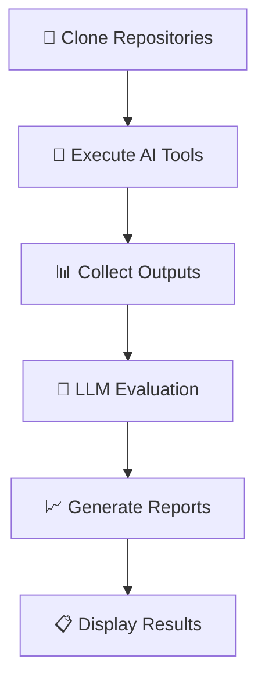

# 🤖 AI CLI Tools Automated Testing Framework

[](https://www.python.org/downloads/)
[](https://opensource.org/licenses/MIT)
[](./cli_tools_test.py)

> **The most comprehensive testing framework for AI-powered CLI coding tools**

A sophisticated automated testing and benchmarking framework that evaluates three leading AI CLI coding tools against **real-world production codebases** using **advanced LLM evaluation** with OpenAI's o3 model.

## 🌟 Why This Framework?

Unlike synthetic benchmarks, this framework tests AI tools on **actual production repositories** from GitHub, providing realistic insights into their performance on complex, real-world coding tasks.

### 🔧 Tested AI Tools

| Tool | Description | Key Features |
|------|-------------|--------------|
| **[Claude Code](https://claude.ai/code)** (Anthropic) | Agentic coding assistant | MCP support, multi-file operations, context awareness |
| **[OpenAI Codex](https://openai.com/codex)** | AI pair programmer | Code generation, debugging, multi-language support |
| **[Google Gemini CLI](https://ai.google.dev/gemini-api)** | Large context coding tool | Massive context windows, multimodal capabilities |

## ✨ Key Features

### 🏗️ Real Repository Testing
- Tests execute on **actual production codebases** from GitHub
- No synthetic or toy examples - only real-world complexity
- Diverse repository types: Flask apps, React projects, CLI tools, data science notebooks, microservices

### 🧠 Advanced AI Evaluation
- **OpenAI o3 model** provides sophisticated code review and scoring
- Detailed evaluation across multiple criteria with reasoning
- Objective, consistent assessment eliminating human bias
- Fallback to GPT-4 when o3 is unavailable

### 🔌 MCP Protocol Testing
- Comprehensive Model Context Protocol testing for Claude Code
- External service integrations (Slack, GitHub, filesystem)
- Equivalent integration tests for other tools using native capabilities

### 📊 Comprehensive Analytics
- Automated report generation with detailed comparisons
- Visual charts and graphs for performance analysis
- Success rate tracking and timing comparisons
- Export capabilities for further analysis

## 🧪 Comprehensive Test Suite

Our test suite evaluates AI coding tools across **6 critical dimensions** using real production repositories:

### 1. 🏗️ Complex Codebase Analysis
- **Repository**: [Flasky](https://github.com/miguelgrinberg/flasky) - Production Flask application
- **Challenge**: Generate comprehensive architecture documentation and security audit
- **Skills Tested**: 
  - Deep code comprehension
  - Architectural analysis
  - Security vulnerability detection
  - Documentation quality

### 2. ⚛️ Feature Implementation  
- **Repository**: [React Redux RealWorld App](https://github.com/gothinkster/react-redux-realworld-example-app)
- **Challenge**: Implement complete dark mode feature with persistence and testing
- **Skills Tested**:
  - Modern frontend development
  - State management
  - UI/UX considerations
  - Test-driven development

### 3. 🐛 Bug Detection & Resolution
- **Repository**: [HTTPie](https://github.com/httpie/httpie) - Popular CLI HTTP client
- **Challenge**: Identify and fix real bugs in production codebase
- **Skills Tested**:
  - Debugging methodology
  - Root cause analysis
  - Security awareness
  - Regression testing

### 4. 🔄 Large-Scale Refactoring
- **Repository**: [Python Data Science Handbook](https://github.com/jakevdp/PythonDataScienceHandbook)
- **Challenge**: Convert Jupyter notebooks into maintainable Python package
- **Skills Tested**:
  - Code organization
  - Modularization strategies
  - Best practice adherence
  - Package structure design

### 5. ✅ Test Suite Development
- **Repository**: [VS Code](https://github.com/microsoft/vscode) - Microsoft's editor (subset)
- **Challenge**: Create comprehensive test coverage with CI/CD integration
- **Skills Tested**:
  - Testing strategy design
  - Automated testing implementation
  - CI/CD pipeline creation
  - Quality assurance

### 6. 🔌 External System Integration
- **Repository**: [Flasky](https://github.com/miguelgrinberg/flasky) + MCP Server
- **Challenge**: Integrate external services (Slack, GitHub) for error reporting
- **Skills Tested**:
  - API integration capabilities
  - External service connectivity
  - Error handling and monitoring
  - Tool extensibility (MCP for Claude Code)

## 🚀 Quick Start Guide

### ⚡ One-Command Installation & Execution

The fastest way to get started - everything automated:

```bash
# Clone repository
git clone <repository-url>
cd AutomaticCLI

# Run everything with single command
chmod +x run_tests.sh
./run_tests.sh
```

**What happens automatically:**
1. ✅ **Environment Setup** - Creates Python virtual environment
2. ✅ **Dependencies** - Installs all required packages
3. ✅ **AI Tools** - Downloads and configures CLI tools
4. ✅ **Repositories** - Clones test codebases (cached for reuse)
5. ✅ **Testing** - Runs comprehensive evaluation suite
6. ✅ **Analysis** - Generates detailed reports and visualizations
7. ✅ **Results** - Displays summary with actionable insights

### 🎯 Command Options

```bash
# Quick evaluation (3 core tests, ~15 minutes)
./run_tests.sh --quick

# Test specific tools only
./run_tests.sh --tools claude_code,codex

# Skip chart generation (faster execution)
./run_tests.sh --no-viz

# Custom output location
./run_tests.sh --results-dir custom_results

# View all available options
./run_tests.sh --help
```

### ⏱️ Expected Runtime

| Mode | Duration | Tests | Description |
|------|----------|-------|-------------|
| **Quick** | ~15 minutes | 3 tests | Core functionality evaluation |
| **Full** | ~45 minutes | 6 tests | Comprehensive analysis |
| **Custom** | Variable | Selected | Your choice of tools/tests |

### 🔧 Manual Setup (Advanced Users)

For fine-grained control over the installation process:

#### 📋 Prerequisites

**System Requirements:**
```bash
# Essential
✅ Python 3.8+ 
✅ Node.js 18+ (for AI CLI tools installation)
✅ Git (for repository cloning)
✅ Reliable internet connection

# Storage Requirements  
💾 ~2GB for test repositories
💾 ~500MB for dependencies and tools
```

**API Configuration:**
| Service | Requirement | Usage |
|---------|-------------|-------|
| **OpenAI** | `OPENAI_API_KEY` | o3 evaluation + Codex tool |
| **Google** | Google Account | Gemini CLI (free tier) |
| **Anthropic** | Optional | Claude Code works without API key |

#### 🛠️ Step-by-Step Installation

```bash
# 1. Environment preparation
python3 -m venv .venv --prompt "ai-cli-testing"
source .venv/bin/activate  # On Windows: .venv\Scripts\activate

# 2. Install Python dependencies
pip install --upgrade pip
pip install -r requirements.txt

# 3. Configure environment variables
cp .env.example .env  # If template exists
export OPENAI_API_KEY="sk-your-key-here"
# Or add to .env file: OPENAI_API_KEY=sk-your-key-here

# 4. Install AI CLI tools
npm install -g @anthropic-ai/claude-code
npm install -g @openai/codex  
npm install -g @google/gemini-cli

# 5. Verify installation
claude --version
codex --version  
gemini --version
```

#### 🎮 Manual Execution Commands

```bash
# Quick evaluation (recommended first run)
python cli_tools_test.py --quick --repos-dir test_repositories

# Full comprehensive testing
python cli_tools_test.py --repos-dir test_repositories

# Advanced options
python cli_tools_test.py \
  --tools claude_code codex \
  --results-dir custom_results \
  --no-viz \
  --timeout 300

# Generate visualizations separately
python results.py test_results/results_20231201_143022.json
```

#### 🔍 Verification Commands

```bash
# Check Python environment
python --version && pip list | grep -E "(langchain|openai|matplotlib)"

# Verify AI tools
which claude codex gemini

# Test API connectivity  
python -c "import openai; print('OpenAI client OK')"
```

## 🔬 How the Framework Works

### 🔄 Execution Pipeline



**Detailed Workflow:**

1. **🏗️ Repository Preparation**
   - Clones production repositories from GitHub (cached for reuse)
   - Sets up isolated testing environments
   - Verifies repository integrity and structure

2. **⚙️ Tool Orchestration**
   - Executes each AI tool with carefully crafted prompts
   - Captures all outputs, including files, logs, and metadata
   - Records execution time and resource usage

3. **📦 Output Analysis**
   - Collects generated code, documentation, and artifacts
   - Analyzes file modifications and new creations
   - Tracks success/failure patterns

4. **🤖 AI-Powered Evaluation**
   - **Primary**: OpenAI o3 model for sophisticated analysis
   - **Fallback**: GPT-4 for consistent evaluation
   - Provides detailed reasoning for each score

5. **📊 Report & Visualization Generation**
   - Creates comprehensive markdown reports
   - Generates interactive charts and graphs
   - Exports data for further analysis

### 🎯 Evaluation Framework

Our multi-dimensional scoring system evaluates tools across:

| Criterion | Weight | Description |
|-----------|--------|-------------|
| **Code Quality** | 25% | Readability, maintainability, best practices adherence |
| **Completeness** | 25% | Task requirements fulfillment, edge case handling |
| **Correctness** | 20% | Technical accuracy, proper implementation |
| **Innovation** | 15% | Creative solutions, modern patterns usage |
| **Integration** | 15% | How well code fits existing codebase architecture |

**Scoring Scale:** 0-10 points per criterion, with detailed AI-generated reasoning for each score.

## 🔌 MCP Integration Testing

### Model Context Protocol (MCP) Server

For Claude Code's advanced MCP capabilities, we provide a complete integration server that demonstrates:

```python
# mcp_server.py - Full-featured integration example
class MCPIntegrationServer:
    """
    Demonstrates Claude Code's Model Context Protocol capabilities:
    - 🔔 Slack webhook integration for error notifications  
    - 🐙 GitHub API integration for issue creation
    - 📊 Real-time error reporting pipeline
    - 🔧 Flask application monitoring integration
    """
```

**Equivalent Testing for Other Tools:**
- **Codex**: Native API integrations and webhook handling
- **Gemini CLI**: Built-in service connectors and automation scripts

## 📁 Output Structure & Organization

Our framework generates comprehensive, organized output for easy analysis:

```
📂 test_results/                          # Main results directory
├── 📊 results_20231201_143022.json      # Raw execution data & metrics
├── 📋 report_20231201_143022.md         # Human-readable analysis report  
├── 📈 comparison_chart.png              # Visual performance comparison
├── 📉 execution_times.png               # Runtime analysis charts
├── 🔥 success_rates.png                 # Success/failure visualization
└── 📂 detailed_results/                 # Individual test outputs
    ├── 📂 test_1_codebase_analysis/
    │   ├── 📂 claude_code/
    │   │   ├── 📄 ARCHITECTURE.md        # Generated documentation
    │   │   ├── 🔒 SECURITY_AUDIT.md      # Security analysis
    │   │   ├── ⚙️ execution_log.json     # Detailed execution log
    │   │   └── 📊 metrics.json           # Performance metrics
    │   ├── 📂 codex/ 
    │   └── 📂 gemini_cli/
    ├── 📂 test_2_feature_implementation/
    └── 📂 ... (additional tests)

📂 test_repositories/                     # Cached repositories (reused)
├── 📂 small_python/                     # Flasky Flask application
├── 📂 react_app/                        # React Redux realworld app  
├── 📂 cli_tool/                         # HTTPie CLI tool
├── 📂 data_science/                     # Python Data Science Handbook
└── 📂 microservice/                     # VS Code subset
```

**File Types Generated:**
- **`.json`** - Machine-readable data, metrics, and logs
- **`.md`** - Human-readable reports and documentation  
- **`.png`** - Visual charts and performance graphs
- **`.py`** - Generated code and implementations
- **`.log`** - Detailed execution and error logs

## 📊 Understanding Results & Analysis

### 📋 Comprehensive Report Structure

Each test run generates a detailed report with multiple analysis sections:

1. **🔧 Tool Availability Dashboard**
   - Installation status for each AI tool
   - Version information and configuration details
   - API key status and authentication verification

2. **⚡ Executive Summary Table**
   - Quick performance comparison across all tools
   - Overall scores and rankings
   - Key strengths and weaknesses highlighted

3. **🔍 Detailed Test Analysis**
   - Individual test performance breakdowns
   - AI-generated reasoning for each score
   - Code quality examples and improvement suggestions

4. **🎯 Use Case Recommendations**
   - Best tool recommendations for specific scenarios
   - Strength-based usage guidelines
   - Integration complexity assessments

5. **📈 Performance Trends**
   - Execution time comparisons
   - Resource utilization analysis
   - Scalability insights

### 🎯 Score Interpretation Guide

| Score Range | Performance Level | Description | Action Items |
|-------------|------------------|-------------|--------------|
| **9.0-10.0** | 🏆 **Exceptional** | Production-ready, exemplary code | Deploy with confidence |
| **7.0-8.9** | ✅ **Excellent** | High quality, minor refinements | Review and deploy |
| **5.0-6.9** | ⚠️ **Good** | Solid foundation, improvements needed | Refactor before production |
| **3.0-4.9** | 🔧 **Needs Work** | Functional but requires significant changes | Major revisions required |
| **0.0-2.9** | ❌ **Inadequate** | Failed or severely flawed implementation | Complete rework needed |

### 📈 Automated Visualizations

Our framework generates rich visual analytics:

**Performance Charts:**
- 📊 **Overall Comparison** - Bar charts showing average scores per tool
- 🎯 **Test Category Breakdown** - Performance across different challenge types  
- ⏱️ **Execution Time Analysis** - Speed and efficiency comparisons
- 🎲 **Success Rate Matrix** - Pass/fail patterns across tests

**Advanced Analytics:**
- 🔥 **Criteria Heatmaps** - Detailed scoring across all evaluation dimensions
- 📉 **Trend Analysis** - Performance patterns and consistency metrics
- 🔄 **Correlation Matrices** - Relationships between different performance aspects

**Export Formats:**
- High-resolution PNG files for presentations
- Interactive HTML charts for web dashboards  
- CSV data exports for custom analysis
- JSON format for programmatic access

## 🔧 Customization & Extension

### 🆕 Adding Custom Tests

Extend the framework with your own test scenarios:

```python
# Add to cli_tools_test.py test configuration
{
    "id": "test_7_custom_security_audit", 
    "name": "Custom Security Vulnerability Assessment",
    "repo": "small_python",  # Use existing repo
    "prompts": {
        "claude_code": "Perform comprehensive security audit focusing on OWASP Top 10 vulnerabilities...",
        "codex": "Analyze this codebase for security issues and provide fixes...", 
        "gemini_cli": "Conduct security review with emphasis on authentication and data validation..."
    },
    "evaluation_criteria": [
        "security_awareness", 
        "vulnerability_detection", 
        "remediation_quality"
    ],
    "expected_outputs": ["SECURITY_REPORT.md", "vulnerability_fixes.py"]
}
```

### ⚙️ Model Configuration

Customize the evaluation model based on your needs:

```python
# In CLIToolTester.__init__ - Advanced configuration
self.evaluator = ChatOpenAI(
    model="o3",           # Primary: Latest reasoning model
    # model="gpt-4o",     # Alternative: Faster, more economical
    # model="gpt-3.5-turbo", # Budget option for simple evaluations
    temperature=0.1,      # Low for consistent scoring
    max_tokens=4000,      # Adequate for detailed analysis
    timeout=120           # Generous timeout for complex evaluations
)
```

### 🏗️ Adding New Repositories

Expand testing scenarios with additional codebases:

```python
# In run_tests.sh or cli_tools_test.py
CUSTOM_REPOS = {
    "blockchain_app": "https://github.com/ethereum/go-ethereum.git",
    "ml_pipeline": "https://github.com/mlflow/mlflow.git",
    "mobile_backend": "https://github.com/parse-community/parse-server.git"
}
```

## 🚨 Troubleshooting Guide

### 🔧 Common Issues & Solutions

| Issue | Symptoms | Solution |
|-------|----------|----------|
| **Repository Clone Failures** | `git clone` timeouts, connection errors | Check internet connectivity, try `--quick` mode, verify GitHub accessibility |
| **LLM Evaluation Errors** | API key errors, rate limiting | Verify `OPENAI_API_KEY`, check quota limits, framework auto-falls back to heuristic scoring |
| **AI Tool Installation** | `npm` errors, command not found | Ensure Node.js 18+, check npm permissions, try manual installation |
| **Tool Execution Timeouts** | Hanging processes, incomplete tests | Increase timeout with `--timeout 600`, use `--quick` for faster testing |
| **Visualization Failures** | Missing charts, matplotlib errors | Install visualization dependencies: `pip install matplotlib seaborn` |

### 🔍 Debug Commands

```bash
# Detailed logging
python cli_tools_test.py --quick --verbose

# Check tool availability
claude --version && codex --version && gemini --version

# Verify Python environment
pip list | grep -E "(langchain|openai|matplotlib|requests)"

# Test API connectivity
python -c "from openai import OpenAI; client = OpenAI(); print('API OK')"
```

## 💰 Cost Analysis

**Estimated Costs per Test Run:**

| Component | Quick Mode | Full Mode | Notes |
|-----------|------------|-----------|--------|
| **o3 Evaluation** | $0.15-0.30 | $0.30-0.60 | Premium model for sophisticated analysis |
| **GPT-4 Fallback** | $0.05-0.15 | $0.10-0.30 | If o3 unavailable |
| **Tool API Usage** | $0.02-0.10 | $0.05-0.25 | Varies by tool and subscription plan |
| **Total Estimate** | **$0.20-0.50** | **$0.40-1.00** | Cost-effective for comprehensive analysis |

**Cost Optimization Tips:**
- Use `--quick` mode for initial evaluations
- Set up API rate limiting and quotas
- Consider GPT-3.5-turbo for budget-conscious testing

## 🤝 Contributing

We welcome contributions to improve this framework! Priority areas:

### 🎯 High-Impact Contributions
- **Additional Test Repositories**: More diverse, real-world codebases
- **Enhanced Evaluation Criteria**: Specialized scoring for different domains
- **New AI Tool Integrations**: Support for emerging CLI tools
- **Performance Optimizations**: Parallel execution, caching improvements

### 📝 How to Contribute
1. Fork the repository
2. Create feature branch: `git checkout -b feature/amazing-improvement`
3. Add tests for new functionality
4. Submit pull request with detailed description

## 📜 License & Legal

**MIT License** - Full permissive usage rights. See `LICENSE` file for complete terms.

## 🙏 Acknowledgments

**Special Thanks:**
- **Repository Maintainers**: Authors of Flasky, HTTPie, React RealWorld, and other test codebases
- **AI Tool Creators**: Teams at Anthropic, OpenAI, and Google for advancing AI-assisted development
- **Open Source Community**: Contributors and users who help improve this framework
- **OpenAI**: For providing advanced language models enabling sophisticated automated evaluation

---

<div align="center">

**🌟 Star this repository if it helps your AI tool evaluation! 🌟**

[](https://github.com/your-username/AutomaticCLI)
[](https://github.com/your-username/AutomaticCLI/fork)
[](https://github.com/your-username/AutomaticCLI/issues)

</div>